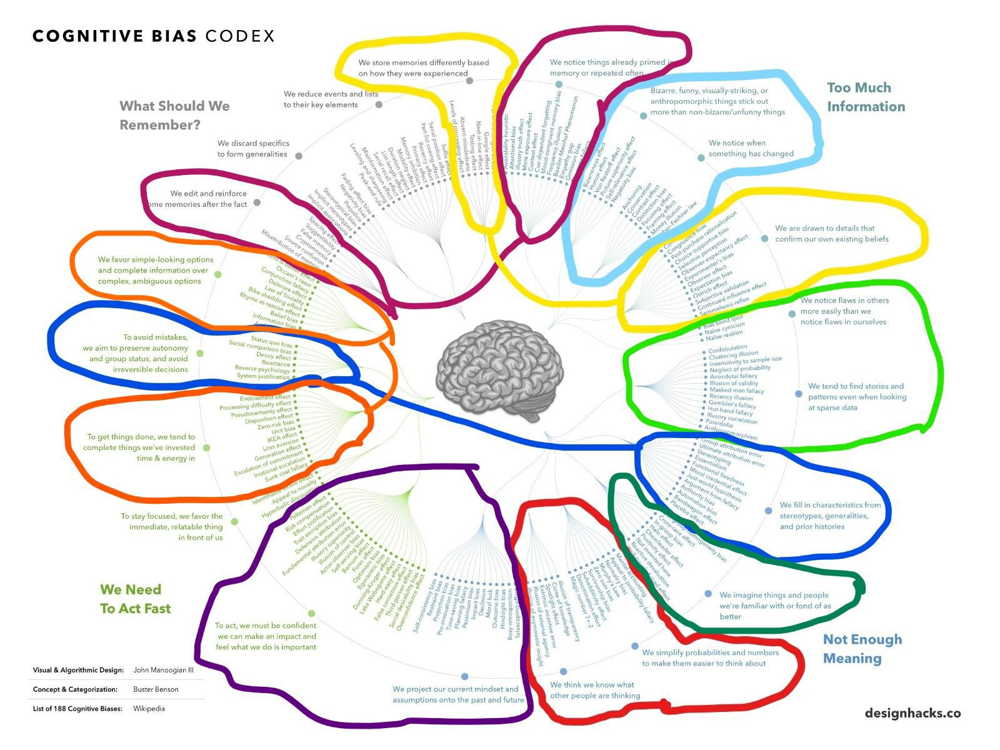

# 💡 Modeling Cognitive Biases

## 🔗 GitHub and GitBook links:

[The project GitBook Presentation](https://maede.gitbook.io/kr-project/)

[The project GitHub Repository](https://github.com/Maedeam/KRKE-cognitive-biases)

***

> _The Brain — is wider — than the Sky_
>
> _For — put them side by side —_
>
> _The one the other will contain_
>
> _With ease — and You — beside —_
>
> _**"Emily Dickinson"**_

With this little part poem, we start our project with the goal of modelling two different clusters of biases taken from the classification made by Buster Benson, posted at this [Medium post.](https://betterhumans.pub/cognitive-bias-cheat-sheet-55a472476b18)

## 🗂 Benson Classification

Buster Benson in his Medium post, categorise all biases in 20 unique mental strategies that we use for specific reasons and then put each cluster of these biases into 4 different general mental problems category, that we can see all in details in this awesome diagram:

<figure><figcaption>
A visualisation of the cognitive bias cheat sheet has been provided by <a href="https://medium.com/@jm3">John Manoogian III.</a>
</figcaption></figure>

\
The 4 general mental problems are:

1. "What should we remember?"
2. "Too much information"
3. "Not enough meaning"
4. "Need to act fast"

## 📍 About our two clusters

By knowing these 4 general mental problems, we choose this two clusters of biases respectfully from the two different mental problems of "Not enough meaning" and "What should we remember?" :

* **We imagine things and people we’re familiar with or fond of as better than things and people we aren’t familiar with or fond of.**
* **We discard specifics to form generalities.**


Now, we deep into our two clusters by details one by one.


### **1- We imagine things and people we’re familiar with or fond of as better than things and people we aren’t familiar with or fond of.**

Similar to some other clusters, but the filled-in bits generally also include built in assumptions about the quality and value of the thing we’re looking at.

This includes:

* [_Halo effect_](https://en.wikipedia.org/wiki/Halo\_effect)
* [_In-group bias_](https://en.wikipedia.org/wiki/In-group\_favoritism)
* [_Not invented here_](https://en.wikipedia.org/wiki/Not\_invented\_here)
* [_Cross-race effect_](https://en.wikipedia.org/wiki/Cross-race\_effect)
* [_Cheerleader effect_](https://en.wikipedia.org/wiki/Cheerleader\_effect)
* [_Well-traveled road effect_](https://en.wikipedia.org/wiki/Well\_travelled\_road\_effect)
* [_Out-group homogeneity bias_](https://en.wikipedia.org/wiki/Out-group\_homogeneity)
* [_Reactive devaluation_](https://en.wikipedia.org/wiki/Reactive\_devaluation)
* [_Positivity effect_](https://en.wikipedia.org/wiki/Positivity\_effect)

### **2- We discard specifics to form generalities.**

We do this out of necessity, but the impact of implicit associations, stereotypes, and prejudice results in some of the most glaringly bad consequences from our full set of cognitive biases.

This includes:

* [_Fading affect bias_](https://en.wikipedia.org/wiki/Fading\_affect\_bias)
* [_Negativity bias_](https://en.wikipedia.org/wiki/Negativity\_bias)
* [_Prejudice_](https://en.wikipedia.org/wiki/Prejudice)
* [_Stereotypical bias_](https://en.wikipedia.org/wiki/Implicit\_stereotype)
* [_Implicit stereotypes_](https://en.wikipedia.org/wiki/Implicit\_stereotype)
* [_Implicit associations_](https://en.wikipedia.org/wiki/Implicit\_stereotype)

***

## 📚 Methodology

### Overview

Our final goal is modelling the biases presented above and create an ontology for semantic web technologies using a specific iterative method for pattern-based ontology design, called **eXtreme Design (XD).**

### **eXtreme Design (XD)**

As stated in the paper _"eXtreme Design with Content Ontology Design Patterns"_ by _Valentina Presutti, Enrico Daga, Aldo Gangemi and Eva Blomqvist_:

> "With the name eXtreme Design (XD), we identify an approach, a family of methods, and associated tools, based on the application, exploitation, and definition of **Ontology Design Patterns (ODPs)** for solving ontology development issues."

In few words, XD is an incremental, iterative method for pattern-based ontology design.

<figure><figcaption>
eXtreme Design (XD)
</figcaption></figure>

As you can see, XD adopts the notion of ontology project, a development project characterised by two main sets:

* _**The Problem Space:**_ which is composed of the actual modelling issues, here referred to as the _local problems_, that have to be addressed during the project.
* _**The Solution Space:**_ which is made up of reusable modelling solutions.

ODPs are associated with Generic Use Cases (GUC) and compose the ontology project’s solution space, which is used as the main knowledge source for addressing ontology design issues e.g. reengineering, evaluation, construction, etc., the ontology project’s problem space provides descriptions of the actual issues called “Local Use Cases” (LUC).

### Ontology Design Patterns

Before exploring the main principles and workflow of XD, it is worthy to spend some words on the methodology on which it is build upon [**Ontology Design Patterns** (Gangemi 2005)](bibliography.md#ontology-design-patterns-gangemi-2005).

Adapting a design idea originally from architecture, introduced by _Christopher Alexander_, ODPs is based on the idea of recurring modelling problems and providing a set of adaptable standard solutions. A _"pattern"_ is a solution to a problem in a given context. Originally described in _"A Pattern Language",_ Alexander states that:

> "The elements of this language are entities called patterns. Each pattern describes a problem that occurs over and over again in our environment, and then describes the core of the solution to that problem, in such a way that you can use this solution a million times over, without ever doing the same way twice."

Ontology Design Patterns provide small reusable (abstract) ontology templates with explicit documentation, stored in a searchable repository ordered by **competency questions** we distinguish:

* **Content Patterns:** Domain dependent, language independent.
* **Logical Patterns:** Domain independent, related to representation language.
* **Presentation Patterns:** Ontology from user perspective, as e.g. naming conventions.
* **Transformation Patterns:** How to transform an ontology in another representation language.

The two basic design principles building blocks are **Logical ODPs** and **Content ODPs (CPs).** The former solve design problems independently of a particular conceptualisation or domain, while the latter, are patterns for solving design problems for the domain classes and properties that populate an ontology; they address content problems. They are connected since Content ODPs are instantiations of Logical ODPs (or compositions of Logical ODPs).

In order to describe **CP**s, each one of them is associated with a _catalogue entry_ including the following set of information fields:&#x20;

* _**Name:**_ provides a name for the pattern.
* _**Intent:**_ describes the _Generic Use Case_ addressed by the pattern.
* _**Competency Questions:**_ contains examples of competency questions that the knowledge base associated with the CP needs to address.
* _**Also Known as:**_ provides other names (if any) with which the pattern is known
* _**Scenarios:**_ provides examples of requirements, expressed in natural language, that can be modeled by using the pattern.
* _**Diagram:**_ depicts a UML class diagram representing the pattern.
* _**Elements:**_ describes the elements (classes and relations) included in the pattern, and their role within the pattern.
* _**Consequences:**_ provides a description of the benefits and/or possible trade-offs when using the patterns.
* _**Known uses:**_ gives examples of realistic ontologies where the pattern is used.
* _**Extracted from/Reengineered from:**_ provides the reference ontology/conceptual schema (if any), from which the pattern has been extracted/reused.
* _**Related patterns:**_ indicates other patterns (if any) that are either a _specialization, generalization, composition,_ or _component_ of the pattern being described.

CPs are reusable solutions to recurrent modelling problems, these problems have two components: a domain and a use case (or task). A same domain can have many use cases, and a same use case can be found in different domains. Ontologies are usually considered models for a domain, but their use case is usually unknown. As reusable solutions, CPs must explicitly encode both a domain and a use case. Since use cases are extremely diversified, a catalogue of CPs requires the notion of a “Generic Use Case” (GUC), i.e. a generalization of use cases that can be provided as examples for an issue of domain modelling. A GUC is the expression of a recurrent scenario in different domain ontology projects. The intuition underlying GUC hierarchies is based on a methodological observation: ontologies must be built out of domain tasks that can be captured by means of _competency questions_. A competency question is a typical query that an expert might want to submit to a knowledge base of its target domain, for a certain task.

How we select the right pattern? Trying to summarise, usually if we try to model a problem, we have two components in our Content ODPs, we have first _**the domain**_ (where this application really will work) and, on the other hand, _**the requirements**_. The same domain can have many requirements and the same requirement can be found in different domains. So domain and requirements are things that are somehow to be represented for your content design pattern. A typical way of capturing requirements is by mean of **Competency Questions**, that are the key to your design patterns we are looking for. Content ODPs are collected and described in catalogues and comply to a common **presentation template**.

Here we provide an example: _Dr. Harald Sack_ in [_"Semantic Web Technologies"_ ](bibliography.md#semantic-web-technologies)model a fact like: _"Basil Rathbone played Sherlock Holmes in the 1939 movie 'The Hound of the Baskervilles'."_ So we want to model the fact that somebody is taking over a temporary role. We need to analyse the sentence that contains the knowledge that need to be represented. We have to match what's is in the sentence with some kind of competency question about a person that plays a character.

<figure><figcaption>
An example of <em>Sherlock Holmes role</em>
</figcaption></figure>

In the _"Problem Space"_ we have all the available competency questions, we need to map our basic sentence to a competency question that is about a person playing a character. If we find one in our _"Problem Space"_ usually we have mapping between the _competency questions_ and the _Ontology Design Patterns_ that are in the _"Solution Space"._ We select for example an ODPs that is described with _"represent objects and roles they play"_ and if it fits to our purpose we can take over this ontology template for our ontology and then represent this fact exactly with the according Ontology Design Pattern.

We need a large repository where we can look for ODPs, the one we will use in our project is [Ontology Design Patterns](http://ontologydesignpatterns.org/).

#### **eXtreme Design principles and tasks**

XD principles are inspired by those of the agile software methodology called eXtreme Programming (XP). The main idea of agile software development is to be able to incorporate changes easily, in any stage of the development. based on the idea of Gangemi A. in [_"eXtreme Design with Content Ontology Design Patterns"_](bibliography.md#extreme-design-with-content-ontology-design-patterns) The method make intensive use of _Content Ontology_ _Design Patterns_ (CPs) and its principles are based on modular design and collaboration. Main XD principles can be summarised as follow:

* **Costumer involvement and feedback.** A key point is to formulate complete and correct assumptions on the domain we want to model. Domain experts should be involved from the start in order to favouring the explicit expression of knowledge that is usually implicit in requirement documents, including competency questions.
* **Costumer stories, Competency Questions (CQs), and contextual statements.** The ontology requirements and its tasks are described in terms of small stories by the costumer representative. Designers work on those small stories and, together with the costumer, transform them in the form of CQs and contextual statements. Contestual statements are accompanyning assertions that explicit knowledge that is typically implicit in CQs. A CQ is a typical query that an expert might want to submit to a knowledge base of its target domain, for a certain task. It is a specific requirement on an ontology or a part of an ontology (e.g. an ontology design pattern). Given certain inputs, the ontology in conjunction with a reasoner can answer the competency question. CQs and contextual statements will be used through the whole development, and their definition is a key phase as the designers have the challenge to help the costumer in making explicit as much implicit knowledge as possible.
* **CP reuse and modular design.** If there is a CP's Generic Use Case (GUC) that matches our Local Use Case (LUC) it has to be reused. For our project we will use the design patterns collected in the [Ontology Design Patterns web site.](http://ontologydesignpatterns.org/wiki/Ontology\_Design\_Patterns\_.\_org\_\(ODP\))

Under the assumption that there exist classes of problems that can be solved by applying common solutions (as it has been experienced in software engineering), the aim is to support reusability on the design side specifically. CPs are a very beneficial kind of pattern for ontology design, because they provide solutions to domain-oriented problems, and are directly reusable.

CPs encode conceptual, rather than logical design patterns. They propose patterns for solving design problems for the domain classes and properties that populate an ontology, addressing content problems. They have an explicit non-logical vocabulary for a specific domain of interest (i.e. they are content-dependent). CPs provide solutions to domain modelling problems and affect only the specific region of the ontology dealing with such domain modelling problems. They are typically reused by applying specialisation, extension, and composition to them. In principle, CPs do not depend on any specific language, however in order to reuse them as building blocks, they have to be implemented in some way. (Gangemi A., Presutti V. Ontology Design Patterns, in Staab S. et al. (eds.): Handbook of Ontologies (2nd edition), Springer, 2009.)

* **Collaboration and Integration.** Since the ontology is developed in a modular way, integration is a key aspect of XD. Collaboration and constant sharing of knowledge is needed in a XD setting, in fact similar or even the same CQs and sentences can be defined for different stories. When this happens, it is important e.g. that the same CP is reused.
* **Task-oriented design.** The focus of the design is on that part of the domain of knowledge under investigation that is needed in order to address the user stories, and more generally, the tasks that the ontology is expected to address. This is opposed to the more philosophical approach of formal ontology design where the aim is to be comprehensive with respect to a certain domain.
* **Test-driven design.** Stories, CQs, and contextual statements are used in order to develop unit tests. A new story can be treated only when all unit tests associated with it have been passed. This aspect enforces the task-oriented approach of the method.
* **Pair design.** The team of designers is organized in pairs. At least one pair is in charge of integrating ontology modules.
