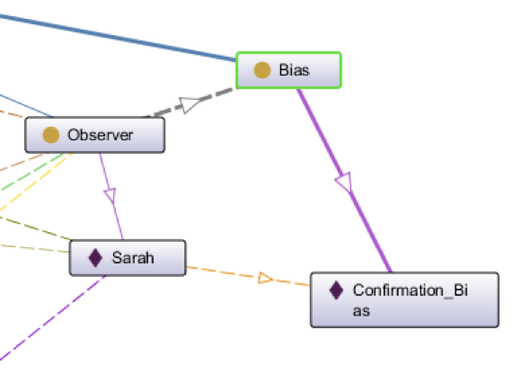

# 〽 eXtreme Design workflow

## The eXtreme Design iterative workflow and 12 tasks

<figure><figcaption>
XD iterative workflow
</figcaption></figure>

***

### **Task 1. Get into the project context**

The project aims to address bias in machine learning models and develop techniques to mitigate its impact. Bias in AI models can lead to unfair and discriminatory outcomes, affecting various aspects of society, such as hiring decisions, loan approvals, and criminal justice systems. The project focuses on identifying, understanding, and rectifying bias to build more equitable and ethical AI systems.

***

### Task 2. Collect requirement stories

We write two stories, possibly from real, documented scenarios, that samples the typical facts that should be stored in the resulting ontology. These stories include a description in natural language.

* #### Story 1

"Sarah, a politically active individual, had a strong confirmation bias towards a particular political party. She avidly followed news sources and social media accounts that shared views aligned with her party's ideology. One day, Sarah came across an article that presented a different perspective on a key issue. Despite the article being well-researched and providing evidence to support its claims, Sarah immediately dismissed it as biased and inaccurate, due to her confirmation bias. She shared the article with her friends, highlighting the parts that confirmed her pre-existing beliefs, reinforcing their shared biases.”

* #### Story 2

“John, a young professional, attends a networking event. As he enters the room, he notices a woman named Sarah standing by herself. Based on her elegant attire and confident posture, John immediately assumes that Sarah is unapproachable and disinterested in talking to him. He decides to focus his attention on other attendees who seem more approachable based on his preconceived notions. Little does John know that Sarah is actually a friendly and welcoming person who would have loved to engage in a conversation. Due to John's bias of discarding specifics to form generalities, he missed out on an opportunity to connect with someone who could have been a valuable professional contact or even a potential friend.”

***

### Task 3. Select a story that has not been treated yet

We choose our two previous stories

***

### Task 4. Transform the story into CQs

The pair process the story and from it derive a set of CQs. First the story is split into simple sentences, meaning that complex example sentences may be broken up into shorter sentences to increase clarity. The sentences are abstracted so that they describe a class of facts instead of a specific one.

An Example:

E.g. Rome is the capital of Italy, it is located in the Lazio region.

The sentences can be generalised in:

A city is the capital of a country. A city is located in a region.

In this case our CQs will be:

* What city is the capital of a certain country?
* In what region is a certain city located?
* In what country is a certain city located?

The CQs in our case will be:

1. Name of the observer is Story 1?
2. Which bias does Sarah exhibits?
3. Which information confirms her bias?
4. She holds belief about?
5. Which information she encountered?
6. Name of the characters in Story 2?
7. List all the generalities in Story 2?
8. Name of the bias does John exhibits in story 2?
9. What is the observation in story 2?
10. What are some specifics in Story 2?

***

### Task 5. Select a CQ that has not been treated yet

* CQ2: _"Which bias does Sarah exhibits?"_

***

### Task 6. Match the CQ to GUCs

This task has the aim of identifying candidate CPs based on the CQ, which express part of the LUC. The matching procedure can be done either with some tool support e.g., keyword based searching, or manually. In our case there was no match of CQ on [http://ontologydesignpatterns.org/](http://ontologydesignpatterns.org/)&#x20;

***

### Task 7. Select the CPs to reuse

The goal of this task is to select which of those patterns should be used for solving the modelling problem. We decided to go with Exhibiting of bias in story1.

***

### Task 8. Reuse and integrate selected CPs

The term _“reuse”_ here refers to the application of typical operation that can be applied to CPs i.e. import, specialisation, and composition. The result of this task is an UML diagram. This task can be divided in sub-tasks:

* **Task 8.1.** Select a CP that has not been integrated yet.
* **Task 8.2.** Specialisation: Identify CP's entities to be specialised and create subclass and sub-property axioms.

Iterate over the sub-tasks until all CPs have been integrated.

SO, in our case, the sub-tasks will be:

* **Task 8.1.** Which bias does Sarah exhibits?
* **Task 8.2.** Specialisation:

#### **Class**

We will first create a subclass of _**owl:Thing**_ which will be _**Bias1**_.

Then we will create two child classes of the _**Bias1**_ class which will be&#x20;

1. _**Observer**_ class
2. _**Bias**_ cclass

#### **Individual**

1. **Observer** Class has an Individual **Sarah**
2. **Bias** class has individual **Confirmation\_Bias**

#### Properties

_**exhibitsBias**_

1. Domain: _**Observer**_ class
2. Range: _**Bias**_ class

After all the above creating of class, properties and individual we will assert **Object Property Assertion** of Sarah that she **exhibitsBias Confirmation\_Bias**

<figure><figcaption>
Task 8
</figcaption></figure>

***

### Task 9. Test and fix

The goal of this task is to validate the resulting module with respect to the CQ just modeled. To this aim, the task is executed through the following steps:

1. The CQ is elaborated in order to derive a unit test, e.g. SPARQL query;
2. The instance module is fed with sample facts based on the story;
3. The unit test is ran against the ontology module. If the result is not the expected one i.e. the test is not passed, the module is revised in order to fix it, and the unit test ran again until the test is passed;
4. Run all other unit tests associated with the story so far until they all pass. Notice that all unit tests are described in dedicated wiki pages that are properly linked to the associated story. If all CQs associated to the story have been addressed, the pair can pass to Task 10, otherwise they “go back” to Task 5.

**SPARQL Query**

<pre><code>PREFIX rdf: &#x3C;http://www.w3.org/1999/02/22-rdf-syntax-ns#>
PREFIX owl: &#x3C;http://www.w3.org/2002/07/owl#>
PREFIX rdfs: &#x3C;http://www.w3.org/2000/01/rdf-schema#>
PREFIX xsd: &#x3C;http://www.w3.org/2001/XMLSchema#>
PREFIX bias: &#x3C;http://www.semanticweb.org/bias#>
SELECT ?subject
<strong>    WHERE { bias:Sarah  bias:exhibitsBias ?subject }
</strong></code></pre>

<figure><figcaption>
Task 9
</figcaption></figure>

***

### Task 10. Release module.

This task identifies the end of an iteration for a pair and its result is an ontology module. Once a whole story has been addressed, and the resulting module has been successfully tested, the new module can be released. The module is assigned with a URI and published in order to be shared by the whole team. If the module can be publicly shared, it can be published in open Web repositories such as ontologydesignpatterns.org. The module is then passed to the pair in charge of the integration. The pair of designer selects a new story if there are still some unaddressed.

***

### Task 11. Integrate, test and fix

Once a new module is released, it has to be integrated with all the others that constitute the current version of the ontology. At least one pair is in charge of performing integration and related tests: new unit tests are defined for the integration, and all existing ones are again executed as regression tests before moving to next task. In this task, all contextual statements are taken into account and all necessary alignment axioms are defined. The module is now under the complete control and editing of the pair in charge of the integration. The products of this tasks are new unit tests and alignment axioms, all properly documented in the wiki.

<figure><figcaption>
Task 11
</figcaption></figure>

***

### **Task 12. Release new version of the ontology**

Once all unit tests have been passed, a new version of the ontology can be released.

***

A tutorial that puts together XD and Pattern-based Ontology Design is provided at the [_Training:EXtreme Design (XD): Pattern-based Ontology Design_](http://ontologydesignpatterns.org/wiki/Training:EXtreme\_Design\_\(XD\):\_Pattern-based\_Ontology\_Design)

